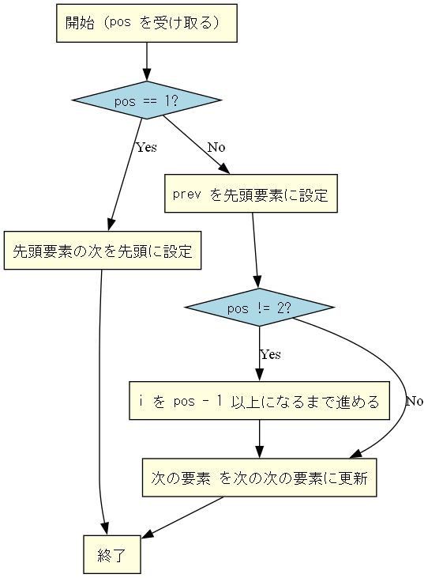
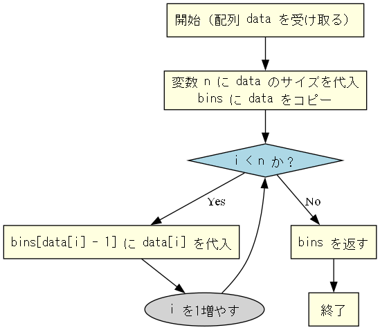
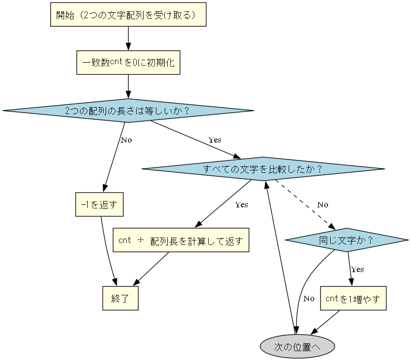
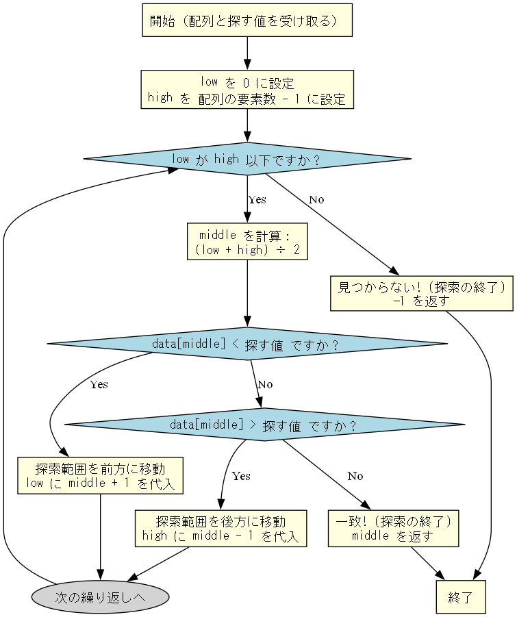
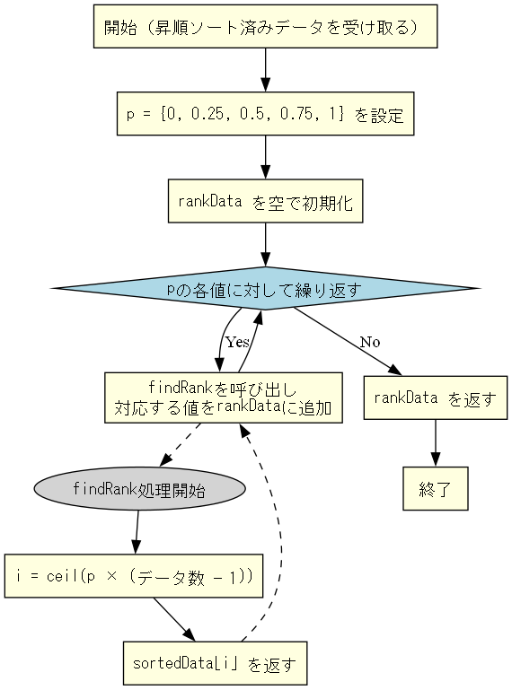
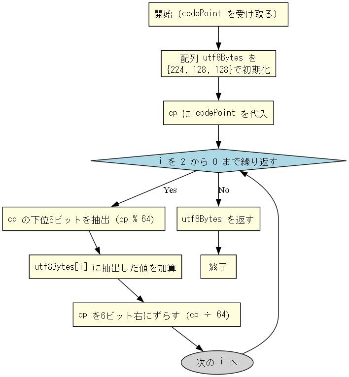

# sample_20221226
2022年12月26日公開分の科目Bサンプル問題の実装プログラム集です。  
C/C++を用いて解答を実装し、アルゴリズムのフローを Graphviz によって可視化しています。

## 各問題のプログラムとフローチャート

| 問題番号 | プログラム | フローチャート |
|----------|------------|----------------|
| 問1      | [Q.01](./Q.01/) |  |
| 問2      | [Q.02](./Q.02/) |  |
| 問3      | [Q.03](./Q.03/) |  |
| 問4      | [Q.04](./Q.04/) |  |
| 問5      | [Q.05](./Q.05/) |  |
| 問6      | [Q.06](./Q.06/) |  |
| 問7      | [Q.07](./Q.07/) |  |
| 問8      | [Q.08](./Q.08/) |  |
| 問9      | [Q.09](./Q.09/) |  |
| 問10     | [Q.10](./Q.10/) |  |
| 問11     | [Q.11](./Q.11/) |  |
| 問12     | [Q.12](./Q.12/) |  |
| 問13     | [Q.13](./Q.13/) |  |
| 問14     | [Q.14](./Q.14/) |  |
| 問15     | [Q.15](./Q.15/) | ※未作成 |
| 問16     | [Q.16](./Q.16/) |  |

## 備考

- 各問題ごとに `graphviz` によるプログラムの流れを視覚化しています。
- 画像は `./Q.0x/プログラムフロー図/` に `graph_Q0x.png` という名前で出力しています。
- フロー図はすべて `MS ゴシック` フォント、黄系ボックスと青い判定ノードで統一。

---

## ライセンス

MIT License に従います。詳しくは [LICENSE](../../LICENSE) を参照してください。
